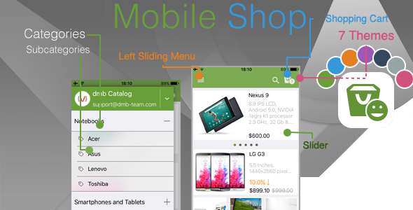
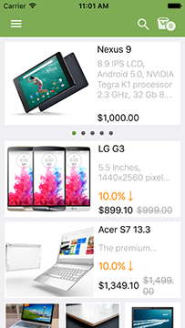
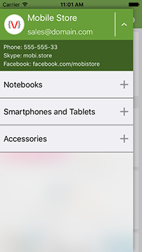
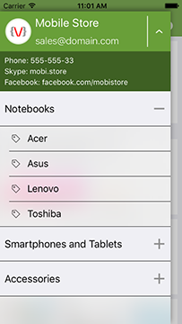
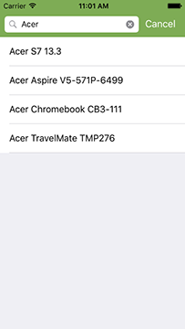
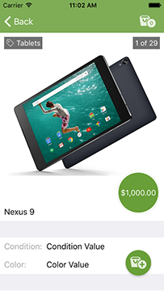
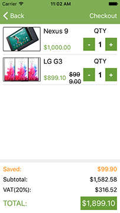
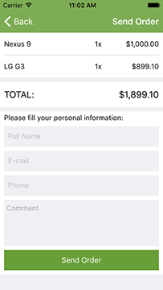

## e-shop

Мобилно приложение/шаблон (template) за специализиран електронен магазин.

### Елементи на приложението:

- Главна страница - списък с всички продукти в главната категория. Включва таблица с продуктите и слайдър с популярни продукти (featured). В навигационната лента са разположени: бутони за търсене и "количка" (дясно), "хамбургер" меню бутон (ляво).
- "Хамбургер" меню с информация за магазина и категории с подкатегории (фиртрират продуктите на главния екран).
- Екран с резултати от търсенето
- Детайли за продукта/алтернативен изглед на продуктите със странициране (paged) с възможност за скролиране между продуктите в категорията. "Sticky" бутон за добавяне в кошницата.
- Кошница - списък с продукти и количества и общата им цена. Бутон "поръка"/"checkout". Изчисляване на "спестени" средства и цени без включено ДДС.
- Поръчка/"checkout" екран с опростен списък на поръчваните продукти. Потребителят въвежда данните и пуска поръчката си по e-mail.

### Технически елементи:

- Зареждане на данните за магазина от JSON (предоставени от екипа) - локален или свален от сървър.
- Зареждане на картинките на продуктите от статични асети (вложени в приложението) или от URL.
- Цветови теми.

# Skype Channel

Скайп канал за комуникация на екипа:
`https://join.skype.com/o6R5qwEo1a0K`

